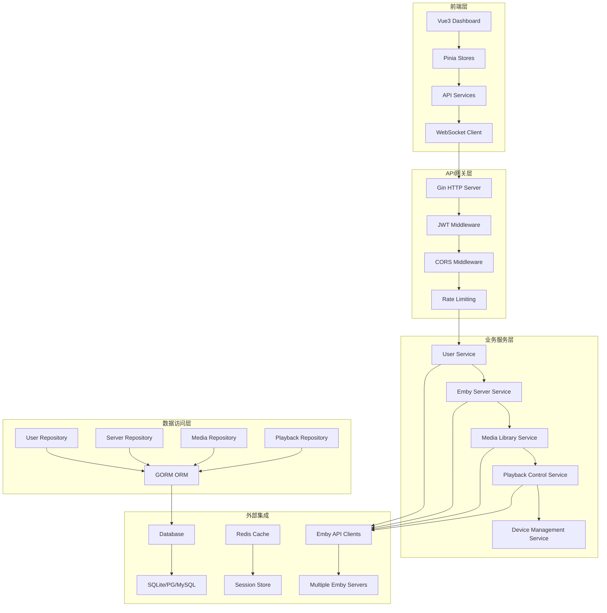

# Design Document - Emby服务器管理平台

## Overview

Emby服务器管理平台采用现代化的前后端分离架构，基于Go Gin框架和Vue3技术栈构建。平台设计遵循领域驱动设计原则，支持微服务演化，提供高可用、高性能、可扩展的多服务器Emby管理解决方案。

## Steering Document Alignment

### Technical Standards
- **Go微服务就绪**: 虽然当前采用单体架构，但设计上支持未来微服务拆分
- **TypeScript前端**: 强类型约束的Vue3 + TypeScript + Vite技术栈
- **容器化优先**: 原生Docker支持，Kubernetes生产部署
- **API优先设计**: RESTful API + OpenAPI文档规范

### Project Structure
遵循标准的Go项目布局和Vue3最佳实践：
```
backend/
├── cmd/server/          # 应用入口
├── internal/           # 内部业务逻辑
├── pkg/                # 可复用包
└── configs/            # 配置文件
frontend/
├── src/
│   ├── components/     # Vue组件
│   ├── views/         # 页面组件
│   ├── stores/        # Pinia状态管理
│   └── services/      # API服务层
```

## Code Reuse Analysis

### Existing Components to Leverage
- **Go Base Framework**: Gin + GORM + JWT + Viper + Logrus 已配置完成
- **Database Models**: 用户、服务器、设备、媒体、播放记录模型已定义
- **Vue3 Frontend Skeleton**: 路由、状态管理、组件结构已搭建
- **Docker Development**: 完整的开发环境容器化配置

### Integration Points
- **Emby API Client**: 需要创建标准化的Emby API客户端
- **Multi-Database Support**: 现有GORM配置支持SQLite/PG/MySQL
- **Authentication System**: JWT中间件和前端状态管理已准备
- **WebSocket Integration**: 实时状态更新和通知系统

## Architecture

### 整体架构图



### 模块化设计原则

**领域驱动设计**:
- **User Domain**: 用户认证、权限管理、个人资料
- **Emby Server Domain**: 服务器连接、状态监控、配置管理
- **Media Domain**: 媒体库管理、搜索聚合、元数据同步
- **Playback Domain**: 播放控制、进度同步、历史记录
- **Device Domain**: 设备注册、状态监控、会话管理

**技术层分离**:
- **Presentation Layer**: HTTP API路由和权限检查
- **Application Layer**: 业务逻辑编排和事务处理
- **Domain Layer**: 领域模型和业务规则
- **Infrastructure Layer**: 数据访问、外部服务、技术实现

## Components and Interfaces

### 后端核心组件

#### 1. 用户认证模块 (`internal/services/auth.go`)
- **Purpose**: 统一用户认证和授权管理
- **Interfaces:**
  - `Login(username, password) (*LoginResponse, error)`
  - `Register(user *User) error`
  - `RefreshToken(token) (string, error)`
  - `ValidatePermissions(userID, resource, action) bool`
- **Dependencies:** JWT工具、用户存储、密码哈希服务

#### 2. Emby服务器管理模块 (`internal/services/emby.go`)
- **Purpose**: Emby服务器连接和状态管理
- **Interfaces:**
  - `AddServer(server *EmbyServer) error`
  - `TestConnection(server *EmbyServer) (*ConnectionTest, error)`
  - `SyncServerInfo(serverID uint) error`
  - `GetAllServers() ([]EmbyServer, error)`
- **Dependencies:** Emby API客户端、状态监控器

#### 3. 媒体聚合服务 (`internal/services/media.go`)
- **Purpose**: 跨服务器媒体库聚合和搜索
- **Interfaces:**
  - `GetAllLibraries() ([]MediaLibrary, error)`
  - `SearchMedia(query *SearchQuery) (*SearchResult, error)`
  - `SyncLibrary(libraryID uint) error`
  - `GetMediaDetail(mediaID string) (*MediaItem, error)`
- **Dependencies:** 多个Emby API客户端、缓存服务

#### 4. 播放控制服务 (`internal/services/playback.go`)
- **Purpose**: 远程播放控制和进度同步
- **Interfaces:**
  - `StartPlayback(deviceID, mediaID) error`
  - `ControlPlayback(control *PlaybackCommand) error`
  - `SyncProgress(progress *PlaybackProgress) error`
  - `PlaybackHistory(userID, limit) ([]PlaybackRecord, error)`
- **Dependencies:** 设备管理、Emby API客户端、WebSocket

#### 5. 设备管理服务 (`internal/services/device.go`)
- **Purpose**: 设备注册和状态监控
- **Interfaces:**
  - `RegisterDevice(device *Device) error`
  - `UpdateDeviceStatus(deviceID, status) error`
  - `GetUserDevices(userID) ([]Device, error)`
  - `CleanupInactiveDevices() error`
- **Dependencies:** 设备存储、状态监控器

### 前端核心组件

#### 1. 认证管理组件 (`src/stores/auth.ts`)
- **Purpose**: 全局认证状态和令牌管理
- **Interfaces:**
  - `login(credentials): Promise<void>`
  - `logout(): void`
  - `refreshToken(): Promise<void>`
  - `checkAuth(): boolean`
- **Dependencies:** API服务、localStorage、路由守卫

#### 2. 服务器管理组件 (`src/stores/servers.ts`)
- **Purpose:** Emby服务器状态和操作管理
- **Interfaces:**
  - `loadServers(): Promise<EmbyServer[]>`
  - `addServer(server): Promise<void>`
  - `testConnection(server): Promise<boolean>`
  - `syncServer(serverID): Promise<void>`
- **Dependencies:** API服务、WebSocket

#### 3. 媒体浏览组件 (`src/stores/media.ts`)
- **Purpose:** 媒体库浏览和搜索状态管理
- **Interfaces:**
  - `loadLibraries(): Promise<MediaLibrary[]>`
  - `searchMedia(query): Promise<SearchResult>`
  - `loadMediaDetail(mediaID): Promise<MediaItem>`
  - `syncLibrary(libraryID): Promise<void>`
- **Dependencies:** API服务、缓存层

#### 4. 播放控制组件 (`src/components/MediaPlayer/`)
- **Purpose:** 媒体播放控制和进度管理
- **Interfaces:**
  - `play(mediaItem): Promise<void>`
  - `control(command): Promise<void>`
  - `updateProgress(progress): void`
  - `getHistory(): Promise<PlaybackRecord[]>`
- **Dependencies:** API服务、WebSocket、音频/视频API

## Data Models

### 核心数据模型扩展

```go
// 用户模型扩展
type User struct {
    ID            uint           `gorm:"primaryKey" json:"id"`
    Username      string         `gorm:"unique;not null" json:"username"`
    Email         string         `gorm:"unique" json:"email"`
    Password      string         `gorm:"not null" json:"-"`
    Role          string         `gorm:"default:user" json:"role"`
    Avatar        string         `json:"avatar"`
    Status        string         `gorm:"default:active" json:"status"`
    FailedAttempts int            `gorm:"default:0" json:"-"`
    LockedUntil    *time.Time     `json:"-"`
    Preferences    string         `json:"preferences"`  // JSON配置
    CreatedAt      time.Time      `json:"created_at"`
    UpdatedAt      time.Time      `json:"updated_at"`
    DeletedAt      gorm.DeletedAt `gorm:"index" json:"-"`
}

// Emby服务器模型扩展
type EmbyServer struct {
    ID              uint           `gorm:"primaryKey" json:"id"`
    Name            string         `gorm:"not null" json:"name"`
    URL             string         `gorm:"not null" json:"url"`
    APIKey          string         `gorm:"not null" json:"-"`
    Version         string         `json:"version"`
    Status          string         `gorm:"default:offline" json:"status"`
    LastCheck       *time.Time     `json:"last_check"`
    SyncInterval    int            `gorm:"default:300" json:"sync_interval"`
    RetryCount      int            `gorm:"default:0" json:"retry_count"`
    Description     string         `json:"description"`
    Settings        string         `json:"settings"`  // JSON配置
    CreatedBy       uint           `json:"created_by"`
    CreatedAt       time.Time      `json:"created_at"`
    UpdatedAt       time.Time      `json:"updated_at"`
    DeletedAt       gorm.DeletedAt `gorm:"index" json:"-"`
}
```

### 前端TypeScript接口

```typescript
// 全局状态接口
export interface AppState {
  user: User | null
  servers: EmbyServer[]
  isLoading: boolean
  notifications: Notification[]
}

// WebSocket消息
export interface WebSocketMessage {
  type: 'server_status' | 'device_status' | 'playback_update'
  data: any
  timestamp: string
}

// 搜索请求接口
export interface SearchQuery {
  keyword?: string
  type?: 'movie' | 'series' | 'episode' | 'music'
  libraryIds?: number[]
  serverIds?: number[]
  page?: number
  pageSize?: number
  sortBy?: 'title' | 'year' | 'rating' | 'date'
  sortOrder?: 'asc' | 'desc'
}
```

## Error Handling

### 分层错误处理策略

#### 1. API层错误
```go
type APIError struct {
    Code    string `json:"code"`
    Message string `json:"message"`
    Details any    `json:"details,omitempty"`
}

// 预定义错误代码
const (
    ErrInvalidCredentials = "INVALID_CREDENTIALS"
    ErrInsufficientPermissions = "INSUFFICIENT_PERMISSIONS"
    ErrServerUnavailable = "SERVER_UNAVAILABLE"
    ErrResourceNotFound = "RESOURCE_NOT_FOUND"
    ErrRateLimitExceeded = "RATE_LIMIT_EXCEEDED"
    ErrEmbyConnectionFailed = "EMBY_CONNECTION_FAILED"
)
```

#### 2. 业务逻辑错误
- **认证失败**: 详细区分用户名错误、密码错误、账户锁定
- **连接错误**: 区分网络超时、认证失败、API不兼容
- **数据同步错误**: 重试机制、部分失败处理、回滚策略

#### 3. 前端错误处理
```typescript
// 全局错误处理
class ErrorHandler {
  static handle(error: APIError) {
    switch (error.code) {
      case 'INVALID_CREDENTIALS':
        ElMessage.error('用户名或密码错误')
        break
      case 'EMBY_CONNECTION_FAILED':
        ElMessage.warning('Emby服务器连接失败，请检查网络')
        break
      // ... 其他错误处理
    }
  }
}
```

## Testing Strategy

### 分层测试策略

#### 1. 单元测试 (Backend)
- **Service层测试**: 认证、服务器管理、媒体服务核心逻辑
- **Repository层测试**: 数据库CRUD操作、查询优化
- **Utility测试**: JWT工具、密码哈希、Emby API客户端

#### 2. 单元测试 (Frontend)
- **Store测试**: Pinia状态管理、计算属性
- **组件测试**: Vue组件渲染、用户交互
- **服务测试**: API客户端、WebSocket连接

#### 3. 集成测试
- **API集成测试**: 完整的HTTP请求-响应流程
- **数据库集成**: 跨表查询、事务处理
- **Emby API集成**: 真实服务器连接测试

#### 4. 端到端测试
- **用户注册登录流程**
- **服务器添加和管理流程**
- **媒体搜索和播放流程**
- **多设备同步测试**
- **多服务器聚合测试**

### 测试环境配置
- **开发测试**: SQLite内存数据库，模拟Emby服务器
- **集成测试**: PostgreSQL Docker容器，真实Emby实例
- **E2E测试**: Playwright自动化浏览器测试

## Security Architecture

### 多层安全体系

#### 1. 认证安全
- **密码安全**: bcrypt哈希，成本因子12+
- **令牌安全**: HS256 JWT，15分钟有效期，自动刷新
- **会话管理**: Redis存储活跃会话，支持强制下线

#### 2. API安全
- **JWT中间件**: 统一令牌验证，过期检查
- **权限控制**: 基于角色的访问控制(RBAC)
- **限流保护**: IP级别和用户级别的限流
- **CORS配置**: 严格的跨域资源共享策略

#### 3. 数据安全
- **传输加密**: 所有API请求HTTPS强制
- **存储加密**: API密钥和敏感配置加密存储
- **输入验证**: 严格的参数验证和SQL注入防护

### 部署安全
- **容器安全**: 最小Docker镜像，非root用户运行
- **网络安全**: 内部服务通信，防火墙配置
- **监控告警**: 异常登录检测、安全事件日志